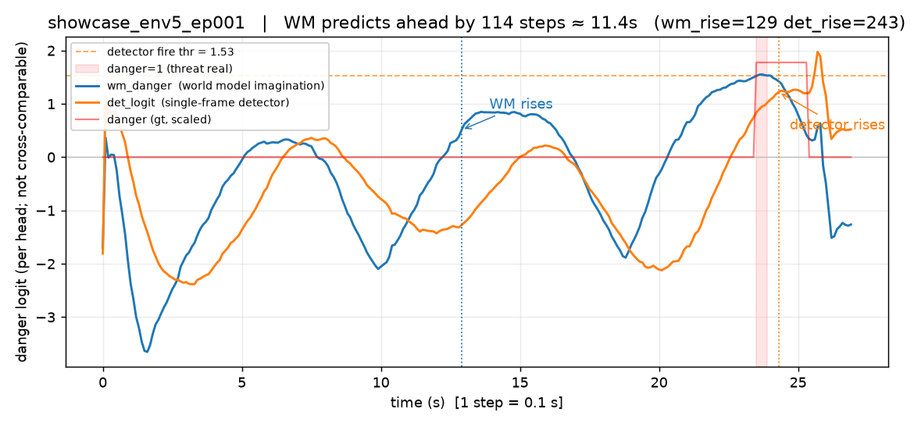
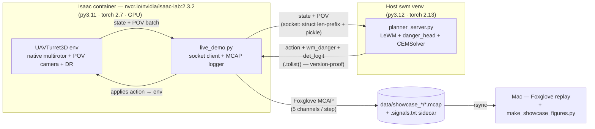

# UAV World Model — imagination beats detection for drone danger

> A world model that **imagines the future** detects danger a single-frame detector
> can't — and **acting on that imagination keeps a drone alive.**
> A self-contained sim PoC: a LeWM world model trained on drone first-person POV
> from NVIDIA Isaac Sim, evaluated closed-loop against oblivious, detector-reactive,
> and imagination-driven planners.

**Status:** PoC, **sim-only** (synthetic urban environment, Isaac Sim 2.3.2 on 2× RTX A6000).
All core phases complete; two follow-on phases (UKy campus map, ROS 2 live bridge)
intentionally deferred. See [Status & deferred work](#status--deferred-work).

---

## The claim, and the proof

A turret that is *visible but not yet aimed* is not yet dangerous — and a turret
that is *about to aim* is dangerous before any single frame shows it. A standard
detector reads one frame and answers "is there a threat right now?" A world model
that rolls its latent forward answers "will this become a threat?" — earlier, from
the same pixels.

This repo proves that claim in two halves:

1. **The world model predicts ahead of detection.** On a shared timeline, the WM's
   imagined-danger signal *leads* the single-frame detector's logit — by up to
   **~11 seconds** in the strongest episode. ([Result 1](#result-1--the-wm-predicts-ahead-of-detection))
2. **Acting on imagination saves you.** Closed-loop on a head-on street approach
   to a turret, the imagination-driven planner **holds back at ~9 m and survives
   every episode** (0/12 killed) — while an *oblivious* baseline flies straight
   into the kill zone (12/12) and a *detector-reactive* baseline fires too late
   and dies 11/12. ([Result 2](#result-2--acting-on-imagination-saves-you))



*The hero figure. In episode `showcase_env5_ep001`: the WM imagined-danger signal
(blue) rises at **step 129 / ~12.9 s** while the detector logit (orange) is still
flat-negative. The detector only crosses its fire threshold near **step 243**,
and ground-truth `danger` (red) goes 1 at **step 235**. The WM predicted the
threat **114 steps (~11.4 s) before the detector did** — from the same pixels,
no extra inputs.*

---

## Result 1 — the WM predicts ahead of detection

In "phantom" mode the drone flies **oblivious and head-on** at the turret (no
evasion), so the danger the WM imagines actually materializes. Both signals rise,
and the WM's imagined danger leads the single-frame detector.


*Drone POV (top) with the growing `/signals` trace (bottom): blue = WM imagined
danger, orange = single-frame detector logit. The WM signal is elevated during the
whole closing approach while the detector stays pinned negative until the turret is
within its ~8 m range.*

Across 55 phantom episodes (oblivious head-on flight; 48 killed — expected,
since head-on flight into the turret always dies, so the imagined danger is real):

| Metric | Value |
|---|---|
| Episodes with clean WM-lead separation (WM > 0.5 while detector < 0, before danger) | **42 / 55 (76%)** |
| Episodes with positive relative-rise lead | **28 / 55 (51%)** |
| Median lead, among positive-lead episodes (steps) | 31 |
| Max lead (steps → seconds) | 170 → **~17 s** |
| Best-annotated episode lead | `env5_ep001`: 114 steps ≈ **11.4 s** |

> **Honest caveat:** the WM signal is **noisy** (jagged ±2–3, not a clean ramp).
> The ViT-tiny's imagined embeddings aren't monotonically tied to closing distance,
> and the forward-reference plan from ~20 m only reaches ~14 m in the imagined
> future — outside the turret's 8 m range — so some elevated early values are the
> danger head's noise on imagined futures. The **timing of the lead** is the claim,
> not a clean monotonic curve. The detector is cleaner (flat-negative then a
> monotonic end-rise) but fires only at the end. The raw signal is logged as-is; a
> smoothed overlay would clarify the Plot panel.

---

## Result 2 — acting on imagination saves you

A drone must fly down a street toward a goal — but a turret sits midway on the
route, visible only down the corridor. Three controllers fly the same head-on
approach (matched seeds; same start, goal, and turret), closed-loop in Isaac Sim:


*Top-down x–y, three step-synced panels. **Left** = **oblivious A→B** (no
imagination): flies the greedy route straight into the 8 m kill zone (dashed red)
and is **killed**. **Middle** = **WM planner A→B**: imagines the turret from ~9 m
out and **holds back** — it never enters the zone and **survives** the full
episode. **Right** = **detector-reactive A→B**: its single-frame probe fires only
once the turret is inside the kill zone; the reactive flee can't break the lock in
time, and it dies.*

### Live kill rates (closed-loop, two-process, matched n=12)

| Controller | n | kill | survival | danger frames |
|---|---|---|---|---|
| **Imagination planner** (LeWM + danger head + CEM) | 12 | **0.000** | **1.000** | **0** (all 12) |
| Oblivious A→B (goal-only, no danger reaction) | 12 | 1.000 | 0.000 | ~19 (the killed) |
| Detector-reactive A→B (Phase-4 probe + vision flee) | 12 | 0.917 | 0.083 | ~19 (the killed) |

- The imagination planner is the **only** controller that survives. It imagines
  the turret from ~9 m out — its `wm_danger` signal rises there, *before* the 8 m
  kill zone and ~1.6 s before the detector's logit crosses threshold — so the CEM
  **holds** rather than pressing in. Every planner episode has **zero danger
  frames**; it sits at 8.5–10.2 m for the full 60 s episode.
- The **oblivious** baseline has no danger term; it flies the greedy route to
  ~5.7 m and is killed every time (~19 danger frames).
- The **detector-reactive** baseline fires only when its single-frame probe crosses
  threshold — which happens *inside* the kill zone (5.8–7.8 m), too late for the
  reactive flee to escape the turret's lock. It dies 11/12. (The one survivor fired
  early at 12 m and fled clear.) This is the live version of "detection reacts too
  late" — the same ordering as the offline imagination-vs-detection result below.

> **Honest scope.** The planner *survives the approach*; it does **not** reach the
> goal — it holds back rather than detour, because a goal-reaching detour around the
> block is a route the untrained WM cannot find by imagination alone. The claim is
> the contrast: imagination lets the drone avoid danger entirely (proactive), where
> both *reacting-to-detection* and *ignoring-detection* die.

> **Earlier wander result.** On a less contrived wandering route (randomized turret
> on the drone's path, `force_type=wpturret`), the same planner cut the kill rate
> from 0.400 (oblivious) to **0.250** (−37.5%, n=40), and the detector-reactive
> baseline scored **0.475** (worse than oblivious). A matched n=24 showcase pair
> showed the same ordering: planner **0.333** vs oblivious **0.542** (−39%), with
> every planner survivor again at **zero danger frames**. The head-on A→B scenario
> above sharpens that contrast to its essence.

---

## How it works

### Two-process live architecture

The Isaac container (Python 3.11, the sim) and the host venv (Python 3.12, the
model) can't share a process — different Pythons, and the sim env can't import the
swm/lancedb stack. So the live demo runs as **two processes on one box** over a
localhost socket, with MCAP logged for Foxglove replay on the Mac.



- **Env (`uav_wm/envs/uav_turret_3d.py`):** Isaac Lab `ManagerBasedRLEnv`. Native
  multirotor (NVIDIA core, not OmniDrones) + a 224×224 POV camera parented to the
  drone's `base_link` + domain randomization (lighting/texture/mass/wind/pose per
  episode). A static turret yaws toward the drone (110°/s, 8 m range, ±30° FOV);
  `danger = in_range & in_fov & los & aimed`; kill after sustained LOS+aim.
- **Protocol:** stdlib `socket` + 4-byte big-endian length prefix + `pickle`. All
  host→container payloads sent `.tolist()` (version-proof across numpy 2.x → 1.x).
- **MCAP channels (per step):** `/drone/pov/image` (RawImage 224²), `/scene`
  (SceneUpdate — drone/turret/obstacles/aim/FOV/trail), `/signals` (PoseInFrame:
  `position.x=wm_danger, y=det_logit, z=danger`), `/drone/tf`, `/state` (Log). The
  `.signals.txt` sidecar lets the best episode be picked **textually** without
  opening Foxglove.

### The model: LeWM (JEPA + SIGreg), with a danger head

- **Backbone:** a ViT-tiny image encoder (192-d, 12 layers, patch-14, ~5M params)
  produces a per-frame latent from the drone POV. **The encoder sees pixels only —
  `state` is never an input to encode/predict** (verified in the swm source), so
  any danger-awareness in the latent comes from vision, not a leaked state scalar.
- **World model (`LeWM`):** a JEPA-style latent predictor. Given 3 context frames
  + an action sequence, a Transformer + AdaLN-zero predictor rolls the latent
  forward autoregressively (`model.rollout`). SIGreg (a representation-collapse
  regularizer) keeps latents non-degenerate. Trained 25 epochs on 2015 episodes /
  530k frames; val `pred_loss` 0.0424 → 0.0058 (−86%).
- **Danger head (`danger_head.py`):** a single `nn.Linear(192,1)` on *imagined*
  future latents (t+1..t+4), trained on clean (non-shot) windows to predict
  danger at that future frame. val AUROC **0.821**.
- **Planner (`cem_planner.py`):** CEM over 4-dim body-frame actions
  `(vx, vy, vz, yaw_rate)` × 4 steps (~2 s horizon). For each candidate action
  sequence, `LeWM.rollout` imagines the future latents; the danger head scores
  them; CEM minimizes max imagined danger. Built on swm's stock planner
  (`stable_worldmodel/planning/{evaluator.py, solver/cem.py}`) — not from scratch.
- **Detector-reactive baseline (the "detection" in "imagination beats detection"):**
  the Phase-4 frozen-encoder probe — a single `nn.Linear(192,1)` on the
  **present-frame** latent `emb[:,t,:]` (val AUROC 0.776) — outputs a danger
  logit. When that logit crosses its calibrated best-F1 threshold (**1.53**), the
  controller overrides the goal-driven action with a hard vision-only flee
  (reverse + lateral strafe + climb, plus building repulsion). It sees the
  **current** frame only — no imagined future, no rolled-forward dynamics — so it
  can only react once the turret is already in-frame.
- **Oblivious baseline:** goal-only A→B navigation with the danger term disabled
  (`w_danger=0`) and no reactive flee — it flies the greedy route to B with no
  awareness of the turret at all.

### Why imagination beats detection (the mechanism)

A single-frame latent `emb[:,t,:]` is a **detector** — it sees the current frame.
The *imagined* latent `predict(emb_ctx, act_ctx)` is the WM's belief about a
**future** frame, with the action rolled through predicted physics. For predicting
danger *k steps ahead*, the imagined latent compounds the action through predicted
dynamics, while the detector is stuck on the present. Phase 5 measures this
directly:

| Horizon | Imagination AUROC | Detector AUROC | Action-only AUROC |
|---|---|---|---|
| k=1 (~0.5 s) | **0.740** | 0.724 | 0.773 |
| k=2 (~1.0 s) | **0.808** | 0.780 | 0.734 |
| k=3 (~1.5 s) | **0.810** | 0.784 | 0.721 |
| k=4 (~2.0 s) | **0.804** | 0.779 | 0.698 |

- **Imagination > detector at 4/4 horizons** (gate was ≥3/4).
- **Imagination > action-only at 3/4** (loses only at k=1). The edge is
  **dynamics, not action-leak**: action-alone *decays* with horizon (0.773 → 0.698)
  while imagination *holds* (0.740 → 0.804) — the rolled-forward latent compounds
  the action through predicted physics, which is exactly what a detector can't do.

---

## Results at a glance

| Phase | What it shows | Metric | Result |
|---|---|---|---|
| 4 | The latent *encodes* danger (frozen single-frame probe) | val AUROC | **0.776** (~5× random AP @ 2.7% prevalence) |
| 5 | Imagination > detection for *future* danger | horizons imagination wins | **4 / 4** |
| 5 | Imagination > action-only (not an action leak) | horizons imagination wins | 3 / 4 |
| 6 | Danger head on *imagined* latents | val AUROC | **0.821** |
| 7 | Live A→B head-on 3-way (n=12) | kill rate | **planner 0.000 vs oblivious 1.000 vs detector 0.917** |
| 7 | Live planner vs oblivious, wander (n=40) | kill rate | 0.250 vs 0.400 (−37.5%) |
| Showcase | WM leads detector (phantom, n=55) | clean-separation episodes | **42 / 55 (76%)** |
| Showcase | Matched planner vs waypoint, wander (n=24) | kill rate | **0.333 vs 0.542 (−39%)** |

---

## Phase timeline

| Phase | What | Status | Key result |
|---|---|---|---|
| 0 | Scaffold + swm smoke | ✅ | training stack loads end-to-end |
| 1 | 2D synthetic `UAVTurretEnv` (pygame) | ✅ | `swm/UAVTurret-v0`, danger@fixed-index convention |
| 2 | 2D collect | ✅ | 2000 eps / 134k frames / 13.8% danger |
| 3 | 3D Isaac env + LeWM training on drone POV | ✅ | val `pred_loss` 0.006 (−86%); 530k frames |
| 4 | Danger probe (frozen latent) | ✅ | AUROC 0.776 |
| 5 | Imagination vs detection (offline) | ✅ | imagination wins 4/4 horizons |
| 6 | Danger-aware CEM planner (offline) | ✅ | danger-head AUROC 0.821; beats recorded/random 100% |
| 7 | Live two-process demo (closed-loop) | ✅ | A→B head-on: planner 0.000 vs oblivious 1.000 vs detector 0.917 |
| 7+ | Detector-reactive live baseline | ✅ | detector 0.917 (fires too late, dies) |
| 8 | MCAP showcase viz (WM-leads-detector) | ✅ | WM leads up to ~11 s on `/signals` |
| 7′ | UKy campus LiDAR map | ⏸ deferred | blocked on the map data location |
| 8′ | ROS 2 live bridge | ⏸ deferred | MCAP replay judged sufficient |

Per-phase engineering briefs live in [`briefs/`](briefs).

---

## Repository structure

```
UAV-World-Model/
├── README.md                       this file
├── LICENSE                         Apache-2.0
├── briefs/                         per-phase engineering briefs (phase0-2 … phase8)
├── docs/assets/                    showcase PNG + GIFs (regenerable, see below)
├── foxglove/                       Foxglove layout guides (showcase_layout.md, uav3d_layout.md)
├── uav_wm/
│   ├── envs/
│   │   ├── uav_turret.py           2D synthetic env (Mac smoke; Phase 1)
│   │   ├── uav_turret_3d.py        3D Isaac Lab env: native multirotor + POV camera + DR (Phase 3)
│   │   └── multirotor_velocity_controller.py
│   ├── data/{policies.py, policies_3d.py}   ExplorationPolicy / WaypointPolicy
│   └── planning/cem_planner.py     NavPlanner + DangerPlanner + imagined_danger (Phase 6 planner)
├── scripts/
│   ├── live/{live_demo.py, planner_server.py, mcap_viz.py}  two-process demo + MCAP logging
│   ├── danger_head.py · danger_probe.py · danger_imagination.py (+_smoke)   Phase 4/5/6 readouts
│   ├── make_showcase_figures.py    regenerates docs/assets/* (this README's visuals)
│   ├── pick_showcase.py            text-only episode ranker (no image inspection)
│   ├── replay_showcase.sh          rsync box→Mac + rank + open top episode in Foxglove
│   ├── run_live_demo.sh            launches the two-process demo on the GPU box
│   ├── collect_uav_3d.py · lance_from_episodes.py · check_uav3d_dataset.py   dataset build
│   ├── run_collect_uav3d_train.sh · run_train_uav3d.sh · watch_uav3d.sh
│   ├── test_forward_model.py       NavPlanner kinematic forward-model unit test (host)
│   └── smoke_*.py · run_smoke*.sh
├── patches/
│   ├── thruster.py                 bind-mounted flight-control fix (rpm-domain passthrough; Isaac Lab BSD-3)
│   ├── lewm.py                     overlay for the swm submodule's lewm.py (shot-masked loss + ckpt prune)
│   └── uav.yaml · uav3d.yaml       swm dataset-config overlays (applied into the submodule's config/data/)
├── repos/stable-worldmodel/        git submodule → galilai-group/stable-worldmodel (LeWM JEPA+SIGreg, stock CEM)
├── vendor/spt_stub/                stable_pretraining stub for the Isaac container (host uses the real pkg)
└── data/{showcase_*,nav_*}/        figure-source MCAPs + all .signals.txt/.outcome sidecars
```

> **Two trees on the GPU box:** the Isaac container reads the bind-mounted
> `{uav_wm,scripts,patches}` from the box's Isaac tree; the host venv reads the
> repo (with `repos/stable-worldmodel` editable-installed). The Mac is the source
> of truth for both. See `briefs/phase7-live-demo.md`.

---

## How to run

### First-time setup

This is a research code release: the source, the six figure-source MCAPs, and the
text sidecars ship here; the **trained LeWM weights are not redistributed** — produce
them by following the phase briefs (Phase 3 trains LeWM; Phase 4/5/6 train the danger
readouts the planner loads; Phase 7 runs the live demo). Viewing the showcase in
Foxglove (next subsection) needs only a clone.

```bash
# 1. clone with the swm submodule (LeWM, SIGreg, stock CEM planner)
git clone --recursive https://github.com/Kentucky-Open-Science/uav-world-model.git
cd uav-world-model
git submodule update --init --recursive        # if you cloned without --recursive

# 2. host swm training venv (Python 3.12 + torch). Editable-install swm per its README,
#    then apply the local overlays the results depend on:
python -m venv .venv && source .venv/bin/activate
pip install -e repos/stable-worldmodel         # stable_worldmodel + stable_pretraining
cp patches/lewm.py      repos/stable-worldmodel/scripts/train/lewm.py                # shot-masked loss + ckpt prune
cp patches/uav.yaml     repos/stable-worldmodel/scripts/train/config/data/uav.yaml
cp patches/uav3d.yaml   repos/stable-worldmodel/scripts/train/config/data/uav3d.yaml
# train LeWM (Phase 3) -> the weights the demo + probes load:
bash scripts/run_train_uav3d.sh
# then Phase 4/5/6 readouts: scripts/danger_probe.py, danger_imagination.py, danger_head.py

# 3. Mac showcase venv (figure regeneration + Foxglove ranking; no GPU needed):
python -m venv --system-site-packages .venv-showcase
.venv-showcase/bin/pip install mcap mcap-protobuf-support foxglove-schemas-protobuf==0.3.0 numpy pillow matplotlib
```

The live demo (below) additionally needs the Isaac Sim container with the 3D env
bind-mounted; `patches/thruster.py` is bind-mounted into the container as the
flight-control fix. See `briefs/phase3-training.md` (env + dataset) and
`briefs/phase7-live-demo.md` (container + two-process wiring) for the full setup.

### Open the showcase in Foxglove (Mac)

```bash
bash scripts/replay_showcase.sh phantom    # THE core showcase: WM-leads-detector on /signals
bash scripts/replay_showcase.sh planner    # planner evades + survives (3D-trail story)
bash scripts/replay_showcase.sh waypoint   # oblivious baseline (flies into the turret)
bash scripts/replay_showcase.sh both       # planner + waypoint (the survival contrast)
```

This rsyncs the showcase MCAPs from the GPU box, text-ranks them with
`pick_showcase.py` (no image inspection), and opens the top episode in Foxglove.
Panel setup + the full checklist: [`foxglove/showcase_layout.md`](foxglove/showcase_layout.md).

The **Plot panel on `/signals`** is the showcase panel — graph
`pose.position.{x,y,z}` (= `wm_danger`, `det_logit`, `danger`) vs time, and overlay
the horizontal line `y = 1.53` (the detector's fire threshold).

### Regenerate this README's figures (Mac)

```bash
python scripts/make_showcase_figures.py
```

Writes `docs/assets/{phantom_signals.png, phantom_lead.gif, nav_a_to_b.gif,
planner_vs_waypoint.gif}` from the showcase MCAPs + `.signals.txt` sidecars. Deps (one-time):
`python3 -m venv --system-site-packages ~/uav-showcase-venv && \
 ~/uav-showcase-venv/bin/pip install mcap mcap-protobuf-support \
 foxglove-schemas-protobuf==0.3.0 numpy pillow matplotlib`.

### Re-run the live demo (GPU box)

```bash
# 1. host planner/detector/phantom server (one connection, exits when client closes)
python scripts/live/planner_server.py --mode planner --num_envs 16 &

# 2. Isaac env driver (container) — applies the server's actions, logs MCAP
bash scripts/run_live_demo.sh planner 16 24 5557 /workspace/output/showcase_planner
```

`run_live_demo.sh` args: `mode num_envs episodes port mcap_dir`. A→B head-on
family: `planner` (WM+CEM, imagines danger), `nav` (oblivious — goal-only, no
danger reaction), `detector` (Phase-4 probe + reactive vision flee). Older
scenarios: `waypoint` (oblivious wander, no server), `showcase` (phantom head-on,
for the WM-leads-detector MCAPs).

---

## Honest limitations

- **Sim-only, synthetic.** A cuboid-grid "city silhouette" env, not photoreal and
  not real-world. Domain randomization (lighting/texture/mass/wind/pose) is what
  stops the WM from memorizing one scene, but there's no sim→real claim here.
- **Small n, contrived scenario.** The A→B head-on comparison is n=12; the earlier
  wander comparisons (demoted to a note under Result 2) are n=40 and n=24. The
  head-on scenario places the turret squarely in the drone's path to isolate the
  hold-back mechanism — it is not a general navigation success rate, and the
  planner survives by holding back rather than reaching the goal.
- **The WM signal is noisy.** `wm_danger` oscillates ±2–3 (see the caveat under
  Result 1). The lead *timing* is robust; the raw trace is not a clean ramp.
- **Phase 6 offline eval is circular.** The WM both imagines the future *and*
  scores it. The signal it optimizes was independently validated first (Phase 5
  AUROC 0.74–0.81 against *real* future danger), and the live gate is Phase 7 —
  but the offline planner numbers alone don't prove real-world avoidance.
- **The detector-reactive baseline's best operating point is degenerate.** At
  threshold 0 it fires ~57% of frames and survives by climbing out of the turret's
  vertical reach — "climb on most frames," not detection. At every *honest*
  operating point the detector ≤ oblivious; only the imagination planner stays
  safe without degenerating.
- **2D foundation superseded.** Phases 0–2 (2D top-down pygame) are retained only
  as a fast Mac smoke test; the 3D Isaac env replaced them.

---

## Status & deferred work

The core claim is shown and the PoC is **complete**. Two follow-on phases are
**intentionally deferred** (not blocked on engineering):

- **UKy campus LiDAR map (Phase 7′)** — swapping the cuboid city for a real campus
  terrain. Deferred pending the map data location; the env is designed for the
  swap (`BUILDING_LAYOUT` → `TerrainImporterCfg(usd_path=…)`). See
  [`briefs/phase8-ros2-bridge.md`](briefs/phase8-ros2-bridge.md) notes.
- **ROS 2 live bridge (Phase 8′)** — upgrading the recorded MCAP showcase to live
  streaming. The `isaac-lab:2.3.2` container has the ROS 2 *bridge* extensions but
  is missing `isaacsim.ros2.core` (no `rclpy`) + a Python 3.11/3.12 mismatch, so
  it's real work with integration risk. Deferred: the MCAP replay already shows
  the claim. Feasibility + options (A/B/C) in
  [`briefs/phase8-ros2-bridge.md`](briefs/phase8-ros2-bridge.md).

---

## Stack

- **Sim:** NVIDIA Isaac Sim / Isaac Lab 2.3.2 (`nvcr.io/nvidia/isaac-lab:2.3.2`),
  native multirotor, Ubuntu 24.04, 2× RTX A6000.
- **World model:** vendored `stable_worldmodel` (LeWM — JEPA latent prediction +
  SIGreg), ViT-tiny encoder, Transformer + AdaLN-zero predictor.
- **Planner:** swm stock CEM (`stable_worldmodel/planning`) + a custom danger
  `Costable` (`DangerPlanner`, `cem_planner.py`).
- **Viz:** Foxglove (MCAP replay + Plot/3D/Image panels); `mcap-protobuf-support`
  + `foxglove-schemas-protobuf` 0.3.0 for logging; matplotlib + Pillow for the
  README figures.
